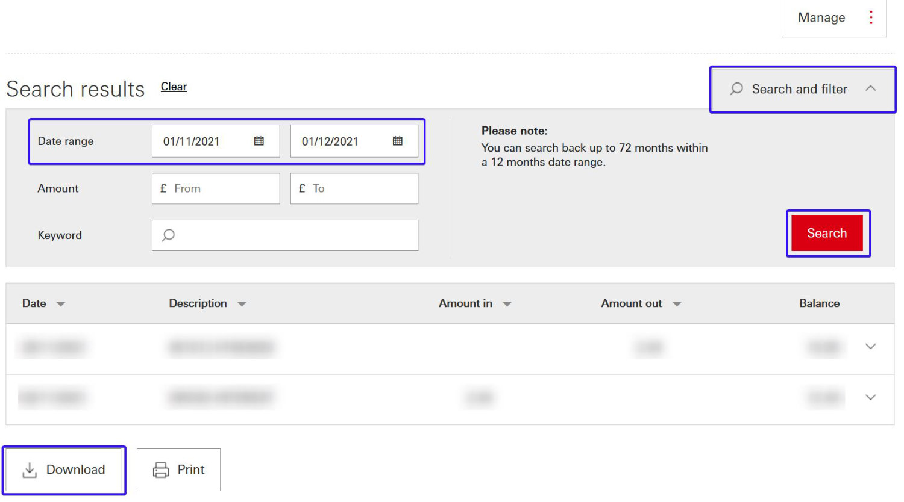

# HSBC CSV Extension
> This Chrome extension scrapes a HSBC UK bank account page to produce a CSV file with all the transactions within a certain date
It is available on the Chrome store [here](https://to.joshheng.co.uk/hsbccsvextension)

## Update
> As HSBC have now updated their website with an in-built method to export transactions as CSV files, this project has now been abandoned and is no longer being maintained.

CSV files can be generated for up to a 12 month range across the last 72 months - simply filter your transactions on your main dashboard and click **Download** at the bottom.

## Usage
Install the extension from the Google Web Store
Log in to your HSBC account and select the account you would like to scrape
Click the extension in the toolbar and select the dates you would like to filter, then download the CSV file